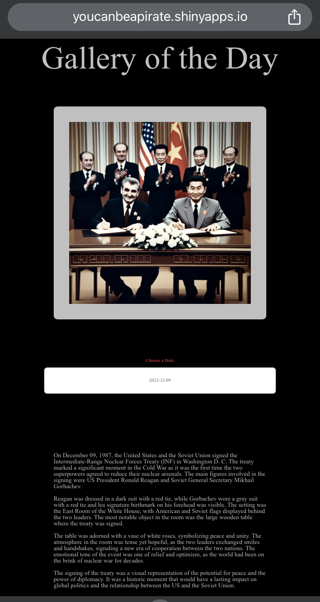

# Gallery of the Day

Gallery of the Day is a web app that shows every day a new AI-created image inspired by something that happened that day in the history.

## 🔍 Features

- 📅 Daily AI-generated images inspired by historical events
- 📱 Mobile-optimized layout with adjusted UI
- 🌙 Elegant dark interface designed for comfortable viewing
- 📜 Uses GPT-4o-mini to research and describe significant events
- 🎨 Creates images with DALL-E 3 based on those descriptions
- 📦 Data updated daily via GitHub Actions and stored in Turso (libSQL) and Cloudflare R2

## 📸 Screenshot



## 🚀 Live App

[👉 Try it here!](https://galleryoftheday.youcanbeapirate.com/)

## Project Structure

```bash
gallery-of-the-day/
├── R/                              # Automation scripts
│   ├── create_prompt.R             # Generates historical event descriptions
│   ├── fetch_image.R               # Creates and downloads DALL-E images
│   └── backfill.R                  # Backfill missing dates
├── app/                            # Shiny application
│   ├── www/
│   │   ├── functions.R             # Helper functions
│   │   └── styles.css              # Custom styling
│   ├── ui.R                        # User interface (bslib + Bootstrap 5)
│   ├── server.R                    # Server logic
│   └── run.R                       # App entry point
├── docs/                           # GitHub Pages site
│   └── index.html                  # Landing page
├── .github/workflows/
│   └── r_scripts_daily.yml         # Daily automation workflow
├── Dockerfile                      # Container image definition
├── docker-compose.yml              # Local development setup
├── deploy.sh                       # Google Cloud Run deployment
└── renv.lock                       # Package dependencies
```

## Tech Stack

| Component | Technology |
| --------- | ---------- |
| Language | R |
| Web Framework | Shiny + bslib |
| AI Models | GPT-4o-mini, DALL-E 3 |
| Database | Turso (libSQL) |
| Image Storage | Cloudflare R2 |
| Automation | GitHub Actions |
| Hosting | Google Cloud Run |
| Package Management | renv |

## How It Works

### 1. Prompt Generation (`create_prompt.R`)

Uses GPT-4o-mini to research a significant historical event for today's date:

> "Could you provide a brief description of a significant historical event that happened on {date} in history? Please include key visual details such as the main figures involved, their clothing, the setting, and any notable objects or symbols."

### 2. Image Generation (`fetch_image.R`)

Sends the historical description to DALL-E 3 to generate a unique artwork. The image is saved with the date in the filename for easy lookup.

### 3. Automation

GitHub Actions runs daily at 4 AM UTC:

1. Generate prompt for today
2. Create and fetch image
3. Commit new files to repository

## Local Development

### Prerequisites

- [Docker](https://docs.docker.com/get-docker/)
- R (>= 4.0) for running automation scripts outside Docker

### Setup

1. Clone the repository:

   ```bash
   git clone https://github.com/AnttiRask/gallery-of-the-day.git
   cd gallery-of-the-day
   ```

2. Copy `.env.example` to `.env` and fill in your credentials:

   ```bash
   cp .env.example .env
   ```

3. Build and run with Docker Compose:

   ```bash
   docker compose up --build
   ```

4. Open <http://localhost:8083>

The `app/` directory is volume-mounted, so code changes are reflected without rebuilding.

### Deployment

See [DEPLOY.md](DEPLOY.md) for Google Cloud Run deployment instructions.

## GitHub Actions Setup

Add these secrets to your repository:

| Secret | Description |
| ------ | ----------- |
| `OPENAI_API_KEY` | Your OpenAI API key |
| `R2_ACCESS_KEY_ID` | Cloudflare R2 access key |
| `R2_ACCOUNT_ID` | Cloudflare account ID |
| `R2_BUCKET_NAME` | R2 bucket name |
| `R2_PUBLIC_URL` | R2 public bucket URL |
| `R2_SECRET_ACCESS_KEY` | Cloudflare R2 secret key |
| `TURSO_AUTH_TOKEN` | Turso authentication token |
| `TURSO_DATABASE_URL` | Turso database URL |

## Recent Completions

- Cloudflare R2 image storage
- Turso database for prompts
- Shiny app UI makeover (bslib, dark theme)
- GitHub Pages landing page
- Google Cloud Run deployment with custom domain

## License

MIT License - see [LICENSE](LICENSE) for details.
