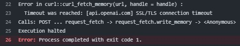

# Gallery of the Day :framed_picture:

What would an art gallery look like if it was...

* online?
* AI-generated?
* refreshed daily?

Oh, and each new image was inspired by an event that happened to happen on the same day, but on some random year in history.

Well, you can see for yourself [here](https://youcanbeapirate.shinyapps.io/gallery-of-the-day/)!

## How it started:

I had been thinking about a small project that would combine my interest in learning [Shiny](https://shiny.posit.co/) and [OpenAI API](https://platform.openai.com/docs/overview) further than I had previously done. I mean, I had
written a [blog post](https://www.youcanbeapirate.com/2022/11/20/how-to-insert-topic-here-with-r-using-the-openai-api/) about using the API with R already back in November 2022.

Originally, I had the idea for the art gallery in March 2023. I even tried to create some images, but Dall-E 2 wasn't great for illustrating such complex prompts and I had to put the project
on a back burner.

When Dall-E 3 entered the scene, I knew I would have to finish the project as soon as it was added to the API. And here we are!

## How it's going:

The gallery is now [online](https://youcanbeapirate.shinyapps.io/gallery-of-the-day/)!

Here's what it looks like (at the moment):

The scripts work (more about them in the next section) when run manually. Currently I have only one problem: GitHub Actions timeout when trying to fetch the image of the day from OpenAI API.
After that's solved, the gallery should run itself. If you have experience on this specific issue, let me know. I would love to hear your suggestions!

## How it works:

The repo is broken into three parts: 

1. Creating the prompt and fetching the image
2. (Re-)deploying the Shiny app on shinyapps.io
3. Automating the previous two with GitHub Actions

### 1. Creating the prompt and fetching the image

I'm using OpenAI's Completions API with the GPT-3.5 Turbo Instruct model to construct the prompt using this prompt (I used GPT-4 to create this one):

> "Could you provide a brief description of a significant historical event that happened on {date} in history? Please include key visual details such as the main figures involved, their clothing, the setting, and any notable objects or symbols. Emphasize elements that would be impactful in a visual representation, and describe the emotional tone or atmosphere of the event."

I'm using str_glue() from the {stringr} package to insert today's date in that prompt. I first tried telling GPT to do it, but that was a mess.

Once that prompt is created, we can run the other script to fetch the image (technically the script first creates the image and then fetches it) using OpenAI's Image generation API with the Dall-E 3 model.

Dall-E 3 actually prettifies the original prompt prior to creating the image. Doesn't really change anything, but it's something to be aware of.

### 2. (Re-)deploying the Shiny app

#### UI

The app itself is pretty straightforward. For UI I'm using...

* fluidPage() function from {Shiny}
* a separate style sheet (CSS)
* separate elements for the image, date input, and the prompt text (serving as a caption)

#### Server

We're reading the prompts data reactively to get the available dates for the date input. We then find the right image and prompt for the selected date (newest being the default).

There is some cleaning that needs to be done for the prompt text. First, there are occasions where there is no space after a period. Then, to make the text more readable, it needs to be chopped into separate paragraphs. Since we can't know what the text will include, there's no easy way to do it perfectly. So instead, there will be a break each time after 400 characters is done (after finishing the sentence that was unfinished).

#### Deploying the app

I just run the deployApp() function from {rsconnect} and it deploys the app to [shinyapps.io](https://www.shinyapps.io/) where I have an account.

### 3. Automating the previous steps with GitHub Actions

I'm using [GitHub Actions](https://github.com/features/actions/) to automate each of the steps. The idea being that once everything is in their places, the process churns a new image daily and deploys it on the website.

The GitHub repo holds the OpenAI API Key and the ShinyApps credentials. And the .yml file controls the workflow.

As I mentioned earlier, my one and only problem at the moment is that there is a connection timeout when GitHub Actions is trying to run the fetch_image.R script (create_prompt.R runs without problems). This is one of those "it worked on my computer" kinds of problems. If you can help, let me know!

## What next?

After solving the timeout problem, I would like to...

* find a better home for the images than GitHub (which isn't really meant for storing such things)
* add 'About this' and 'About me' tabs on the page
* tweak CSS a little bit more
* think about maybe tweaking the prompt some... at least the first few images have been about politics, war and murder. It is interesting to see if there are any guardrails (there used to be) for this kind of imagery. But mainly I would like to see something more uplifting every once in a while.

Is there something you would like to see? Let me know!
